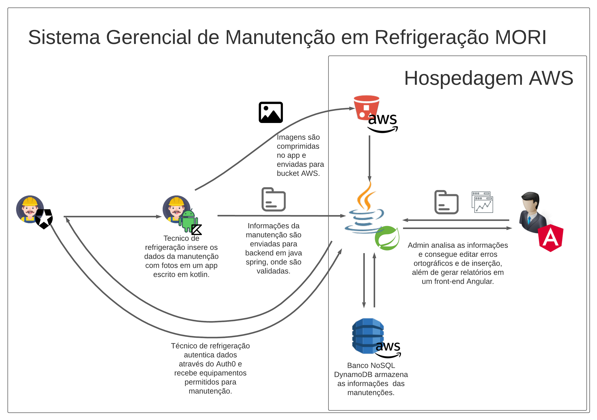

## Stacks

##### Backend:
- Java + Spring | C# + .Net
##### Frontend:
- HTML + CSS + Typescript + Angular
##### Mobile:
- Kotlin
##### Database:
- Oracle PL/SQL
- Mysql
- DynamoDB
- PostgreSQL

## Experiences

For a more updated version of my professional experiences, please visit my LinkedIn profile.
https://www.linkedin.com/in/trajanolc/

## Projects

#### 🔭 I have a project running in production made all by myself, it's basically a full integrated system to manage air-conditioners maintenance with:

- Android app for technicians.
- Angular dashboard for managers.
- Spring backend to make the comunication
- DynamoDB and S3 Bucket to save data.

You can see the schema below:

## Thanks!

- If you got here, thank you for your interest. Here have a cookie 🍪
